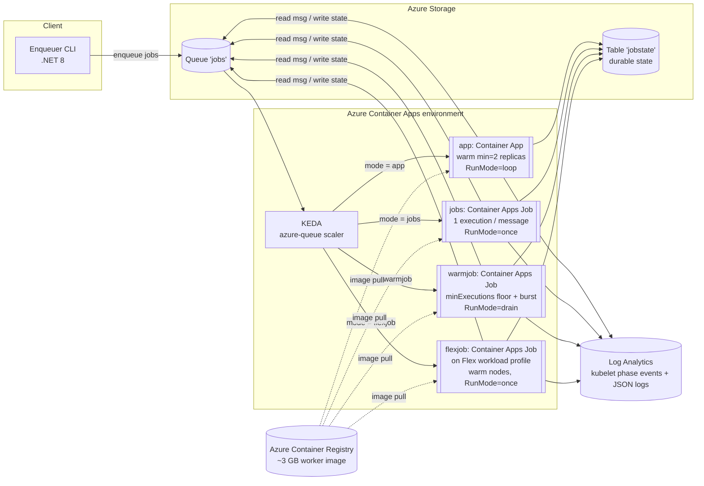

# aca-quick-work-apps-vs-jobs

A deployable benchmark and reference template for running **quick, queue-triggered work on Azure
Container Apps** when your worker image is large (~3 GB), comparing four deployment shapes
head-to-head:

| Mode | What it is | Cold-start cost | Mid-job scale-in safety |
| --- | --- | --- | --- |
| **`app`** | Long-running Container App, KEDA queue scaler, warm `min=2` replicas | **1–3 s** on a warm replica; ~50 s image pull when bursting onto a cold node (end-to-end longer under queue-wait, ~168 s observed) | ❌ replicas can be killed mid-job on scale-in |
| **`jobs`** | Event-driven Container Apps **Job** (one execution per message) | **~92 s** end-to-end on **every** execution (always cold) | ✅ an execution is never scaled-in while running |
| **`warmjob`** | Container Apps Job with a warm `minExecutions=2` floor + drain-aware worker | **1.8–4.2 s** on the warm floor; ~47 s image pull when bursting onto a cold node (up to ~120–162 s under capacity pressure) | ✅ run-to-completion *and* warm pickup |
| **`flexjob`** | Same event-driven Job, but scheduled on a **Flex workload profile** (single-tenant nodes that never scale to zero) | **~85 s** on the first (cold) execution; **~18 s** once the node has the image cached — the ~52 s pull becomes a *one-time* warm-up, not per-execution | ✅ an execution is never scaled-in while running |

It deploys end-to-end with a single `azd up`, is self-contained (no internal dependencies, secrets,
or hard-coded subscriptions), and is the basis for the benchmark in
[`docs/benchmark-results.md`](docs/benchmark-results.md).

---

## Why this exists

A customer runs a .NET worker that processes long jobs (5–45 min) pulled from an Azure Storage
Queue. Their image is **~3 GB**, so a cold pull takes well over 30 seconds. To stay under their
30-second start tolerance they run a **regular Container App** with warm, already-running replicas
(the big image is pulled once; work then starts in single-digit seconds) and scale it with a KEDA
azure-queue rule.

The problem: when the queue drains, **KEDA scales replicas in — and a replica processing a
long job can be terminated mid-flight**, losing in-progress work. "Just use Jobs" removes that risk
(a Job execution is never scaled-in) but reintroduces the ~50 s cold pull on *every* message,
breaking the 30 s budget.

This template makes that trade-off measurable and shows two more options: a **warm Job**
(`warmjob`) that keeps a `minExecutions` floor warm for fast pickup **and** lets each execution run
to completion (draining gracefully before its `replicaTimeout` instead of being killed), and a
**Flex-profile Job** (`flexjob`) that runs the same event-driven Job on a single-tenant Flex
workload profile whose nodes never scale to zero — so the ~3 GB image stays cached on-node and the
~52 s pull is paid once as a warm-up rather than on every execution.

---

## Requirements

- **azd** (Azure Developer CLI) 1.9+
- **Azure CLI** 2.55+
- **.NET SDK** 8.0+
- **Docker** 24+ (only needed for local image builds; `azd` builds the deployed image for you)
- **PowerShell** 7+
- An Azure subscription where you can create resources and assign roles

Full details in [`docs/setup.md`](docs/setup.md).

---

## Quickstart

```pwsh
# 1. Sign in
az login
azd auth login

# 2. Pick a deployment mode (default is "app")
azd env set DEPLOYMENT_MODE app       # warm Container App + KEDA queue scaler (default)
# azd env set DEPLOYMENT_MODE jobs     # event-driven Container Apps Job (cold per execution)
# azd env set DEPLOYMENT_MODE warmjob  # Container Apps Job with a warm minExecutions floor
# azd env set DEPLOYMENT_MODE flexjob  # event-driven Job on a Flex workload profile (warm nodes, cached image)

# 3. Provision + build + deploy everything (prompts for env name + location)
azd up

# 4. Enqueue some work and watch it run
./scripts/enqueue.ps1 -Batch "10x300,10x600"

# 5. Tear everything down
azd down --force --purge
```

`azd up` provisions a resource group, Log Analytics workspace, Storage account (queue + table for
durable job state), Container Registry, a user-assigned managed identity (`AcrPull`), a Container
Apps environment, and the worker compute for the chosen mode. It then builds the worker image,
pushes it to ACR, and deploys it.

> **The worker image is padded to ~3 GB by default** (`IMAGE_PADDING_GB=3` in `azure.yaml`) so pull
> and cold-start timing match the customer's environment. Set `azd env set IMAGE_PADDING_GB 0` for
> fast iteration when you don't care about the heavy-image timing.

---

## Benchmark results

Measured on real deployments with the customer-aligned configuration and the ~3 GB image. The
`app`, `jobs`, and `warmjob` lanes were measured in **Sweden Central**; the `flexjob` lane was
measured in **South Central US** (Flex profile) — cold-pull time is region/ACR-dependent, so treat
the cross-lane Flex comparison as directional. Full methodology, per-phase tables, and raw kubelet
numbers are in [`docs/benchmark-results.md`](docs/benchmark-results.md).

**Headline — "message in queue → worker is processing it":**

| Path | Time |
| --- | --- |
| **App — pre-warmed `min=2` replica** | **1–3 s** (no scheduling, no pull, no container start) |
| App — scale-out replica on a **warm node** (image cached) | 22–52 s (≈0 s pull) |
| App — scale-out replica on a **cold node** (full 3 GB pull) | ~168 s¹ |
| **Job — every execution (always cold)** | **~92 s** |
| **Warm-Job — pickup on the warm `minExecutions=2` floor** | **1.8–4.2 s** (worker already polling, image cached on-node) |
| Warm-Job — burst above the floor, **warm node** (image cached) | 2–5 s (≈0.1 s pull) |
| Warm-Job — burst above the floor, **cold node** (full 3 GB pull) | ~46–49 s (47.5 s pull); up to ~120–162 s under capacity pressure |
| **Flex-Job — first execution on a cold Flex node** (full 3 GB pull) | **~85 s** (~52 s pull) |
| **Flex-Job — execution on a warm Flex node** (image cached) | **~18 s** (0.1 s pull) |

¹ Includes queue-wait behind the pre-warmed replicas, which had already drained the early messages.

**Takeaways:**

- The 3 GB image pulls in **~45–52 s on a cold node regardless of mode** — Apps and Warm-Jobs don't
  pull *faster*, they **avoid the pull** on warm replicas/floor executions.
- A plain **Job pays the full cold start (~92 s) on every message** — great isolation, poor latency
  for short/bursty work.
- A **Warm-Job gets the App's single-digit-second pickup *and* the Job's run-to-completion
  guarantee** — the floor stays warm and each execution drains before `replicaTimeout` instead of
  being killed mid-job.
- A **Flex-Job keeps the Job's run-to-completion guarantee and removes the *per-execution* pull**:
  because Flex nodes never scale to zero, the 3 GB image stays cached on-node, so the ~52 s pull is
  a one-time warm-up and later executions start in **~18 s**. It is *not* an App-style warm floor
  (a fresh pod is still scheduled per message, so the ~18 s of poll + scheduling + init remains) —
  it removes the image-pull portion of cold start, not the pod-scheduling portion.

---

## Architecture



One worker image runs in all four modes, selected by `Worker:RunMode`:

- **`loop`** (app) — poll the queue forever; the container is a warm, long-running replica.
- **`once`** (jobs, flexjob) — process one message, record state, exit 0; one execution per message.
  `flexjob` uses the same `once` worker but runs on a Flex workload profile, whose single-tenant
  nodes don't scale to zero — so the ~3 GB image stays cached on-node and each execution after the
  first skips the pull.
- **`drain`** (warmjob) — poll like `loop`, but stop accepting new work `DrainSafetyMarginSeconds`
  before `replicaTimeout` and exit 0 so a fresh execution rolls over the warm floor — giving fast
  pickup without ever being SIGKILLed mid-job.

The worker deletes a queue message **only after** it durably records `Completed`, so interrupted
work is never silently lost — it reappears on the queue and the durable table shows
`Started`/`Progress` without `Completed`.

---

## Repository structure

Key files (the `.NET` projects also carry their standard `.csproj`, `Program.cs`,
`appsettings.json`, and `Models/`/`Services/` sources):

```
.
├── azure.yaml                  # azd service + infra definition (azd up / azd down)
├── Dockerfile                  # multi-stage cross-build; ARG IMAGE_PADDING_GB inflates to ~3 GB
├── Dockerfile.benchmark        # amd64-native variant for `az acr build` (server-side 3 GB image)
├── LICENSE                     # Apache License 2.0
├── README.md
├── .gitignore  .dockerignore
├── infra/                      # Bicep (azd-wired)
│   ├── main.bicep              # subscription-scope entry: RG + resources + deploymentMode param
│   ├── main.parameters.json    # azd-bound parameters (DEPLOYMENT_MODE, drain knobs, scaling)
│   └── resources.bicep         # storage, ACR, identity, Log Analytics, ACA env + App / Job (Flex profile for flexjob)
├── src/
│   ├── Worker/                 # .NET 8 queue worker (AcaQueueRepro.Worker)
│   │   ├── Worker.cs           # poll loop, RunMode loop/once/drain, SIGTERM-aware drain logic
│   │   ├── Program.cs          # generic Host + AddHostedService<Worker>
│   │   ├── Models/             # WorkerOptions, JobPayload, JobState, JobStateRecord
│   │   └── Services/           # JobStateStore (Azure Table durable state)
│   └── Enqueuer/               # .NET 8 CLI (Program.cs) to enqueue job batches onto the queue
├── scripts/                    # PowerShell helpers
│   ├── enqueue.ps1             # push job batches ("NxS" = N jobs of S seconds)
│   ├── run-repro.ps1           # apply a scaling profile and re-provision
│   ├── refresh-warm-floor.ps1  # postdeploy hook: roll the warmjob floor onto the real image
│   ├── collect-evidence.ps1    # surface started-but-never-completed jobs + shutdown events
│   ├── cleanup.ps1             # wraps azd down --force --purge
│   └── _common.ps1             # shared azd-env helpers
└── docs/
    ├── setup.md                # prerequisites + deploy
    ├── repro.md                # run the scaling profiles, Kusto queries, decision criteria
    ├── benchmark-results.md    # App vs Jobs vs Warm-Job vs Flex-Job cold-start timing (~3 GB image)
    ├── observations.md         # per-run notes
    ├── results.md              # final outcome vs. success criteria
    └── next-fix-hypotheses.md  # mitigation candidates
```

---

## Tuning knobs

Set via `azd env set <NAME> <value>` before `azd up`. The most common knobs are below; the full set
of parameters (scaling: `MIN_REPLICAS`, `MAX_REPLICAS`, `QUEUE_LENGTH`, `POLLING_INTERVAL`,
`REPLICA_TIMEOUT`, `JOB_MAX_EXECUTIONS`, `WARM_JOB_MIN_EXECUTIONS`, `FLEX_WORKLOAD_PROFILE_TYPE`, …)
lives in `infra/main.parameters.json`. `IMAGE_PADDING_GB` is the exception — its default (`3`) is
the build arg in `azure.yaml`.

| Env var | Default | Applies to | Purpose |
| --- | --- | --- | --- |
| `DEPLOYMENT_MODE` | `app` | all | `app` \| `jobs` \| `warmjob` \| `flexjob` |
| `IMAGE_PADDING_GB` | `3` | all | image size padding (`0` = fast lite build); set in `azure.yaml` |
| `DRAIN_SAFETY_MARGIN_SECONDS` | `300` | warmjob | how long before `replicaTimeout` the worker stops taking new work and drains; must exceed worst-case cold-start drift |
| `DRAIN_STAGGER_SECONDS` | `60` | warmjob | spread floor rollovers so they don't all roll at once |
| `FLEX_WORKLOAD_PROFILE_TYPE` | `Flex` | flexjob | workload profile type provisioned on the environment and referenced by the Job |

---

## Building the real ~3 GB image (prefer `az acr build`)

Pushing a 3 GB layer from a laptop through the Docker proxy is slow and prone to `broken pipe`.
Build it **server-side in ACR** — only the tiny source context uploads and the padding is generated
in-cloud:

```pwsh
az acr build -r <acr> -t aca-quick-work-apps-vs-jobs/worker:bench3gb `
    --platform linux/amd64 --build-arg IMAGE_PADDING_GB=3 -f Dockerfile.benchmark .
```

`Dockerfile.benchmark` is the amd64-native variant for ACR builds (the classic ACR dependency
scanner cannot parse the `--platform=$BUILDPLATFORM` cross-build directives in the main
`Dockerfile`). ACA runs x86/amd64 only — always build with `--platform linux/amd64`.

---

## Troubleshooting

- **3 GB push fails / `broken pipe` from a laptop** — build server-side with `az acr build` (above)
  instead of `docker push`.
- **`warmjob` floor runs the placeholder image after deploy** — azd provisions the Job with a
  placeholder image and starts the `minExecutions` floor against it; ACA never restarts a running
  execution on image update. The `scripts/refresh-warm-floor.ps1` postdeploy hook rolls only the
  stale/placeholder executions onto the real image (it leaves real-work executions running). It runs
  automatically on `azd up`; re-run it manually if needed: `pwsh ./scripts/refresh-warm-floor.ps1`.
- **`flexjob` deploy fails with `ContainerAppInvalidResourceTotal`** — Flex profiles only accept
  fixed CPU/memory combos (`0.25/1Gi`, `0.5/2Gi`, `1/4Gi`, `2/8Gi`, …). The template auto-snaps the
  default `0.5 CPU` to `2Gi` for `flexjob`; if you override `WORKER_CPU`/`WORKER_MEMORY`, pick a
  valid pair. Flex availability is also region-specific — check with
  `az containerapp env workload-profile list-supported --location <region>`.
- **`AssigningReplicaFailed` / long warm-Job burst tail** — regional capacity pressure; the node
  can't be provisioned immediately, stretching cold-node pickup to ~120–162 s. Retry or pick a
  region with more headroom.
- **Reading platform timing** — kubelet phase events (`AssigningReplica`, `PullingImage`,
  `ImagePulled`, `ContainerCreated`, `ContainerStarted`, `ContainerAppReady`) land in the
  per-environment **Log Analytics** workspace, *not* a regional Kusto cluster. Use the KQL in
  [`docs/repro.md`](docs/repro.md#useful-kusto-queries-log-analytics).
- **Scale-in killed an in-flight `app` job** — that's the failure this template demonstrates. Use
  `warmjob` or `flexjob` (both run-to-completion) or see
  [`docs/next-fix-hypotheses.md`](docs/next-fix-hypotheses.md).

---

## License

Licensed under the [Apache License 2.0](LICENSE).
